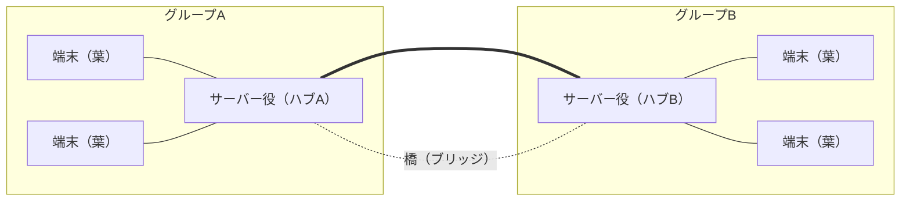

# LiqMesh 分散システム設計書（現状＋スター連邦＋助言オペレーター）

> ※ この設計書は「次に追加すべき機能」を、コードを読まなくても筋が追えるようにまとめたものです。むずかしい言葉はできるだけ避け、使うときはその場で括弧の中に平易な言い換えを添えています。要件の概要は `docs/adr/README.md`（Mako さん作成・レビュー中）に、本日の議論の経緯は `docs/minutes/2026-06-01.md` にあります。本書はその「具体設計版」という位置づけです。

設計書全体の要旨: いまは「1 台のサーバー役に、みんなの端末がぶら下がる星のような形」で動いている。これを **Stage1: サーバー役を 2 台にして橋でつなぐ形** へ広げ、さらに任意で **Stage2: 混雑時に質問を振り分ける助言役（オペレーター）** を足す。どちらも既存の 1 台デモを壊さないよう、設定で初期 OFF にする。

---

## 1. いまの仕組み（現状の整理）

要旨: 1 台のサーバー役を中心に、チャット・蓄積・追いつき同期・AI 要約が動いている。

- **形**: 「1 台のサーバー役に、みんなの端末がぶら下がる星のような形」です。サーバー役は設定画面で手動 ON にします（自動では選びません）。
- **重複しない仕組み**: メッセージには 1 つずつ通し番号（ID）が付きます。同じ ID のメッセージが届いたら、受け取った側がそれを捨てるので、二重に表示されません。
- **電波が切れている間**: 各端末は届けられなかった分を自分の中に保存しておき、つながり直したら「自分がまだ持っていない分だけ」をもらって追いつきます。
- **AI（LFM）**: サーバー役の端末の上で LFM（小さな AI）が動き、流れてきた情報を要約して配ります。要約の処理は重いので、**同時に 1 件だけ**走らせます。

---

## 2. Stage1「スター連邦（2 ハブ・ブリッジ）」

要旨: サーバー役を 2 台にして橋でつなぐ。橋が原因の事故（メッセージの無限往復・AI の二重回答・橋切れ）を、それぞれ単純なルールで防ぐ。

「スター連邦」とは「星のような小さなグループを橋でつないで、ゆるく 1 つにまとめる形」のことです。「ブリッジ」はその「橋」のことです。

- **形**: サーバー役を 2 台にして、その 2 台どうしを橋でつなぎます。3〜4 台の端末・PC でデモできる見込みです。

### 2.1 メッセージが橋を無限に往復しないようにする

橋を渡すと、同じメッセージが 2 台のあいだを行ったり来たりして、際限なく増えてしまう危険があります。これを 2 つの仕組みで止めます。

- **一度運んだメッセージは二度運ばない**: 運んだメッセージの ID を覚えておき、同じものがまた来たら「もう運んだ」と分かるので捨てます。
- **橋を渡った回数を数えて上限で止める**: そのメッセージが橋を何回渡ったかを数えておき、**上限（2 回）** を超えたらそれ以上は運びません。

### 2.2 AI の答えが二重に出ないようにする

サーバー役が 2 台あると、同じ質問が両方に届いて、答えが 2 つ返ってしまうことがあります。

- 基本ルール: **その質問を最初に受け取った 1 台だけが答える**。
- 例外: ごくまれに、本当に同時に受け取ってしまったときだけ、両方の答えを記録に残し、利用者に「2 つの案」として見せます。

### 2.3 生きているか確認し合う＋切れたら独立して動く

- 2 台のサーバー役は、定期的に「生きてる?」という信号を送り合って、相手が動いているかを確認します。
- もし橋が切れたら、**それぞれのグループは切れたまま、別々に動き続けます**（止まりません）。
- 橋がつながり直したら、**離れていた間に増えた分（足りない分）だけ**をやり取りして、状態をそろえ直します。

### 2.4 既存を壊さない（保険を残す）

- ここまでの 2 台連携の仕組みは、**設定で初期状態 OFF** です。ON にして初めて 2 台連携が動きます。
- そのため、**今までどおりの「1 台サーバーのデモ」はいつでもできます**（うまくいかなかったときの保険になります）。

---

## 3. Stage2「助言オペレーター（混雑の振り分け役・任意）」

要旨: 混雑時に質問を空いているサーバーへ回す「オペレーター」を置く。投票で決めず、各自が同じ計算で同じ 1 人を選ぶ。命令ではなく助言なので、落ちても基本ルールへ自然に戻る。

「オペレーター」とは「混雑したときに、新しい質問を空いているサーバー役へ振り分ける役」のことです。

### 3.1 誰がオペレーターかを投票で決めない

- 投票で決めると壊れやすいです（たとえば 2 台が同時に「自分がやる」と名乗り出てしまう事故が起きます）。
- そこで**投票はしません**。代わりに、各サーバーが「**自分の待ち件数**（＝処理を待っている質問がどれだけ溜まっているか）」を、2.3 の「生きてる?」信号に**ついでに乗せて**共有します（連絡の回数は増えません）。
- みんなが同じ情報を見ているので、「**待ち件数が一番多い人＝もし同点なら端末の ID 番号が小さい人**」を、**全員がそれぞれ自分で計算して同じ結論**にたどり着けます。だれかが宣言しなくても、自然に同じ 1 人を指せます。

### 3.2 オペレーターは「命令」ではなく「助言」

- オペレーターが出すのは命令ではなく **助言** です。
- もし助言が古かったり、オペレーター役の端末が落ちてしまったりしたら、各サーバーは **2.2 の基本ルール（最初に受け取った 1 台が答える）へ自動で戻ります**。
- そのため、「役割を別の端末へ引き継ぐための、特別で難しい処理」を作らずに済みます。

### 3.3 役割がコロコロ変わらないようにする

- 役割が頻繁に入れ替わると不安定なので、「**振り分けた回数が 10 回を超えたら一旦休む**」といった区切りの数値（＝ここを超えたら動きを変える、という目印の数字）を入れます。

### 3.4 位置づけ

- これは **任意（Stage2）** です。Stage1（2 台連携）が安定してから着手します。

---

## 4. 今回やらないこと（将来の検討事項）

要旨: 重い仕組みは今回は作らない。詳しくは議事録のC節に整理済み。

以下はいずれも今回のスコープ外です（将来やりたいこと）。

- 全サーバーが全データを常に完全にそろえ続ける方式
- 1 台壊れても困らないようにする多重化（同じものを複数持って備える）
- 処理の途中経過を巻き戻して、やり直し・再開する仕組み
- 「書く担当」と「読む担当」をサーバーで分ける役割分担
- 本格的な負荷分散装置（大量のアクセスを自動で振り分ける専用の仕組み）
- 画像の共有

詳細は議事録 `docs/minutes/2026-06-01.md` の **C 節（今後の検証事項・将来の仕様案）** に整理済みです。

---

## 5. 関連ドキュメント

- 要件のサマリ: `docs/adr/README.md`（Mako さん作成・レビュー中）
- 本日の議論の記録: `docs/minutes/2026-06-01.md`
- 実装の詳細な手順書は別途ローカルで管理（git では共有していません）。

---

## 6. 図: 葉—ハブA—橋—ハブB—葉

「葉」は、ぶら下がっている普通の端末（サーバー役ではない端末）のことです。「ハブ」はサーバー役の端末のことです。



文字だけの図でも示すと、次の形です。

```
端末（葉） ─┐                        ┌─ 端末（葉）
            ├─ サーバー役（ハブA）══橋══ サーバー役（ハブB）─┤
端末（葉） ─┘                        └─ 端末（葉）
```
