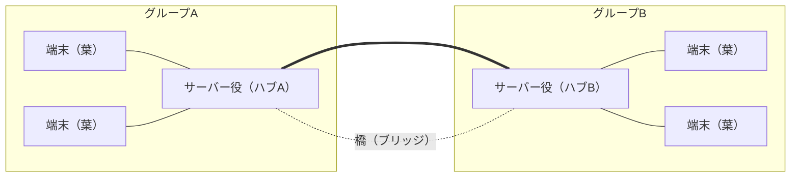

# LiqMesh 分散システム設計書（実装済み・as-built）

> ※ この設計書は、すでに**実装が完了して main に取り込まれた**仕組みを、コードを読まなくても筋が追えるようにまとめたものです。むずかしい言葉はできるだけ避け、使うときはその場で括弧の中に平易な言い換えを添えています。要件の概要は `docs/adr/README.md`（Mako さん作成・レビュー中）に、議論の経緯は `docs/minutes/2026-06-01.md` にあります。
>
> ※ 実装は **JVM のループバックテスト（PC の中だけで端末役を複数立ち上げて、つなげて確かめる試験）では検証済み**です。一方で、**実機（本物のスマホを複数台つないだ確認）はまだ済んでいません**（エミュレータは NAT というネットワークの仕切りの都合でサーバー役どうしを直接つなげられないためです）。

設計書全体の要旨: いまは「サーバー役の端末に、みんなの端末がぶら下がる星のような形」で動く。さらに **Stage1: サーバー役を 2 台にして橋でつなぐ形** と、**Stage2: 混雑時に質問を振り分ける助言役（オペレーター）** を実装した。どちらも既存の 1 台デモを壊さないよう、設定で初期 OFF にしてある。

---

## 1. いまの仕組み（実装済み）

要旨: 星型（1 台のサーバー役にみんながぶら下がる形）＋橋（サーバー役を 2 台つなぐ）＋オペレーター（混雑の振り分け役）まで、すべて動く状態。橋とオペレーターは設定で初期 OFF、ON にすると 2 台連携が動く。

- **形**: 「サーバー役の端末に、みんなの端末がぶら下がる星のような形」です。サーバー役は設定画面で手動 ON にします（自動では選びません）。
- **重複しない仕組み**: メッセージには 1 つずつ通し番号（ID）が付きます。同じ ID のメッセージが届いたら受け取った側がそれを捨てるので、二重に表示されません。
- **電波が切れている間**: 各端末は届けられなかった分を自分の中に保存しておき、つながり直したら「自分がまだ持っていない分だけ」をもらって追いつきます。
- **AI（LFM）**: サーバー役の端末の上で LFM（小さな AI）が動き、流れてきた情報を要約して配ります。要約の処理は重いので、**同時に 1 件だけ**走らせます。
- **2 台連携・振り分け**: サーバー役を 2 台つなぐ「橋」と、混雑を振り分ける「オペレーター」も実装済みです。どちらも初期 OFF で、設定で ON にすると 2 台が連携します（詳細は 2・3 章）。

---

## 2. Stage1「スター連邦（2 ハブ・ブリッジ）」（実装済み）

要旨: サーバー役を 2 台にして橋でつなぐ仕組みを実装。橋が原因の事故（メッセージの無限往復・AI の二重回答・橋切れ）を、それぞれ単純なルールで防いでいる。

「スター連邦」とは「星のような小さなグループを橋でつないで、ゆるく 1 つにまとめる形」のことです。「ブリッジ」はその「橋」のことです。

- **形**: サーバー役を 2 台にして、その 2 台どうしを橋でつなぎます。2〜4 台の端末・PC でデモできます。

### 2.1 メッセージが橋を無限に往復しないようにする（実装済み）

橋を渡すと、同じメッセージが 2 台のあいだを行ったり来たりして際限なく増える危険があります。これを 2 つの仕組みで止めています。

- **一度運んだメッセージは二度運ばない**: 運んだメッセージの ID を覚えておき（＝「もう見た」リスト、seen-set）、同じものがまた来たら捨てます。
- **橋を渡れる回数に上限を付ける**: そのメッセージが橋を何回渡ったかを数えておき、**上限（2 回）** を超えたらそれ以上は運びません。

### 2.2 AI の答えが二重に出ないようにする（実装済み）

サーバー役が 2 台あると、同じ質問が両方に届いて答えが 2 つ返ることがあります。

- 基本ルール: **その質問を最初に受け取った 1 台だけが答える**（最初に「自分が答える」と名乗る合図＝summary_claim を出した 1 台だけが処理する）。
- 例外: ごくまれに本当に同時に受け取ってしまったときだけ、両方の答えを記録に残し、利用者に「2 つの案」として見せます（すれ違った両方のログを残します）。
- なお「自分が答える」という名乗りは、**橋でつながっている相手からしか受け付けません**（ぶら下がっている普通の端末からは受け付けない）。

### 2.3 生きているか確認し合う＋切れたら独立＋つなぎ直しで同期（実装済み）

- 2 台のサーバー役は、定期的に「生きてる?」という信号（ハートビート＝一定間隔の生存確認）を送り合います。
- 橋が切れたら、**それぞれのグループは切れたまま別々に動き続けます**（止まりません）。
- 橋がつながり直したら、**離れていた間に増えた分（足りない分）だけ**を**お互いに**やり取りして、両側の状態をそろえ直します（双方向の差分同期）。

### 2.4 既存を壊さない（実装済み）

- 2 台連携の仕組みは **設定で初期状態 OFF** です。ON にして初めて動きます。
- そのため **今までどおりの「1 台サーバーのデモ」はいつでもできます**（うまくいかなかったときの保険になります）。

---

## 3. Stage2「助言オペレーター（混雑の振り分け役）」（実装済み）

要旨: 混雑時に質問を空いているサーバーへ回す「オペレーター」を実装。投票で決めず、各自が同じ計算で同じ 1 人を選ぶ。命令ではなく助言なので、落ちても基本ルールへ自然に戻る。

「オペレーター」とは「混雑したときに、新しい質問を空いているサーバー役へ振り分ける役」のことです。

### 3.1 待ち件数を生存確認信号に相乗りさせる（実装済み）

- 各サーバーが「**自分の待ち件数**（＝処理を待っている質問がどれだけ溜まっているか）」を、2.3 の「生きてる?」信号に**ついでに乗せて**共有します。**連絡の回数は増えません**（既にある信号に相乗りするだけ）。

### 3.2 オペレーターを投票で決めない（実装済み）

- 投票で決めると壊れやすいです（たとえば 2 台が同時に「自分がやる」と名乗り出る事故が起きます）。
- そこで**投票はしません**。みんなが同じ情報（各自の待ち件数）を見ているので、「**待ち件数が一番多い人＝もし同点なら端末の ID 番号が小さい人**」を、**全員がそれぞれ自分で計算して同じ結論**にたどり着けます（決定的に選ぶ＝同じ入力なら誰が計算しても同じ答え）。だれも宣言しなくても、自然に同じ 1 人を指せます。

### 3.3 役割がコロコロ変わらないようにする（実装済み）

- 役割が頻繁に入れ替わると不安定なので、**連続して条件を満たしたときだけ交代する**ようにしています（ヒステリシス＝行ったり来たりを抑える「のりしろ」のような仕組み）。

### 3.4 オペレーターは「命令」ではなく「助言」（実装済み）

- オペレーターが出すのは命令ではなく **助言** です。「混雑時はこのハブに回して」という**ヒント**を出すだけで、各サーバーはそのヒントを使って「自分が手を挙げるタイミング」を少しずらします（バイアスをかける）。
- もし助言が古かったり、オペレーター役の端末が落ちたりしたら、各サーバーは **2.2 の基本ルール（最初に受け取った 1 台が答える）へ自動で戻ります**（床にフォールバック＝下の安全ルールへ落ちる）。
- そのため、「役割を別の端末へ引き継ぐための、特別で難しい処理」を作らずに済んでいます。

---

## 4. 設計の肝＝2 層構造

要旨: 「正しさの床」は常時 ON で絶対に弱めない。オペレーターの助言はその上で「手を挙げる順番」を変えるだけ。助言が壊れても答えは壊れない。

LiqMesh の答えの正しさは、**2 つの層**で守られています。

- **下の層＝正しさの床（常時 ON、絶対に弱めない）**: 「最初に受け取った 1 台が答える」というルール（2.2）。これがあるので、**二重に答えることがありません**。この層はオペレーターの ON/OFF に関係なく、いつも効いています。
- **上の層＝オペレーターの助言（任意）**: 「どのハブが先に手を挙げるか」というタイミングを変えるだけ（3.4）。混雑をならすための味付けにすぎません。

ここが大事な点です。助言が古くなっても、オペレーター役の端末が落ちても、各ハブは**下の床のルールへ自動で戻る**ので、**答えが壊れない・消えない**。上の層は「速さ・効率」のための飾りで、下の層が「正しさ」を保証します。

---

## 5. 既知の制約（正直に明記）

要旨: 動くが、いくつか割り切った前提がある。実機未確認である点も含め、隠さず書く。

- **差分同期の取りこぼし**: つなぎ直しの追いつき（差分同期）は「自分が持っている最新時刻より後の分をもらう」方式です。そのため、**橋が切れた瞬間に両側がほぼ同時刻に書いた 2 件**は、一度で揃わない場合があります（1 件ずつなら回収できます）。完全な双方向回収には、将来「橋ごとの目印（どこまで送った／もらったかの印）」を持たせる改良が要ります。
- **自己申告の検証なし**: 待ち件数・端末 ID・宛先ヒントは、各端末の**自己申告**です。現状はその中身を検証していません（同じ Wi-Fi の、信頼できる仲間内での利用が前提）。仮に悪意ある端末がいても、**答えの正しさ（二重に答えない・消えない）は守られ、効率が落ちるだけ**です。なりすまし対策は将来課題です（社内で管理している Task #21 と同じ根の課題）。
- **負荷分散は双方向の橋で最大限効く**: 「1 台に集約して 1 件だけ答える」効率は、**両ハブが互いに橋を張る（双方向）構成**でいちばん効きます。片方向の橋だけでも**答えの正しさは保たれます**が、稀に 2 案出ます（効率が少し落ちる）。
- **橋は片方だけが設定する運用を推奨**: 橋は「どちらか片方だけが相手の IP を設定する」運用を推奨します。両方が設定すると橋が二重になります。
- **実機未確認**: 本書冒頭のとおり、JVM ループバックテストでは検証済みですが、本物のスマホを複数台つないだ確認はこれからです。

---

## 6. 今回やらないこと（将来の検討事項）

要旨: 重い仕組みは今回は作らない。詳しくは議事録のC節に整理済み。

以下はいずれも今回のスコープ外です（将来やりたいこと）。

- 全サーバーが全データを常に完全にそろえ続ける方式
- 1 台壊れても困らないようにする多重化（同じものを複数持って備える）
- 処理の途中経過を巻き戻して、やり直し・再開する仕組み
- 「書く担当」と「読む担当」をサーバーで分ける役割分担
- 本格的な負荷分散装置（大量のアクセスを自動で振り分ける専用の仕組み）
- 画像の共有

詳細は議事録 `docs/minutes/2026-06-01.md` の **C 節（今後の検証事項・将来の仕様案）** に整理済みです。

---

## 7. 使い方・デモ手順

要旨: 2 台をサーバー役にして橋でつなぎ、他の端末をぶら下げる。チャット中継・要約・切断復帰までを確認する。

同じ Wi-Fi につないだ 2〜4 台で確認します。

1. **1 台目**: 設定画面で「サーバーモード ON」にする。
2. **2 台目**: 「サーバーモード ON」にし、さらに「別のサーバー役の端末とつなぐ」を ON にして、**相手（1 台目）の IP を入力**する。これで橋がかかります。
3. **残りの端末**: それぞれどちらかのサーバーに接続する（ぶら下がる）。

確認すること:

- **チャット相互中継**: 片方のグループで送ったメッセージが、橋を越えてもう片方のグループにも届く。
- **要約**: AI 要約が二重に出ず、1 件だけ返る。
- **切断復帰**: 橋を切る → 各グループが独立して動き続ける → つなぎ直す → 離れていた間の差分が両側でそろう。

---

## 8. 関連ドキュメント

- 要件のサマリ: `docs/adr/README.md`（Mako さん作成・レビュー中）
- 議論の記録: `docs/minutes/2026-06-01.md`
- プロダクト全体の狙い: `docs/00_inception_deck.md`
- 実装の詳細な手順書は別途ローカルで管理（git では共有していません）。

---

## 9. 図: 葉—ハブA—橋—ハブB—葉

「葉」は、ぶら下がっている普通の端末（サーバー役ではない端末）のことです。「ハブ」はサーバー役の端末のことです。



文字だけの図でも示すと、次の形です。

```
端末（葉） ─┐                        ┌─ 端末（葉）
            ├─ サーバー役（ハブA）══橋══ サーバー役（ハブB）─┤
端末（葉） ─┘                        └─ 端末（葉）
```
